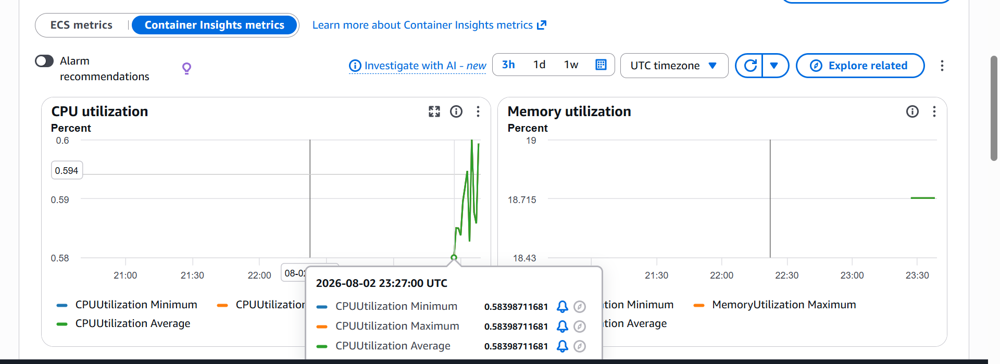
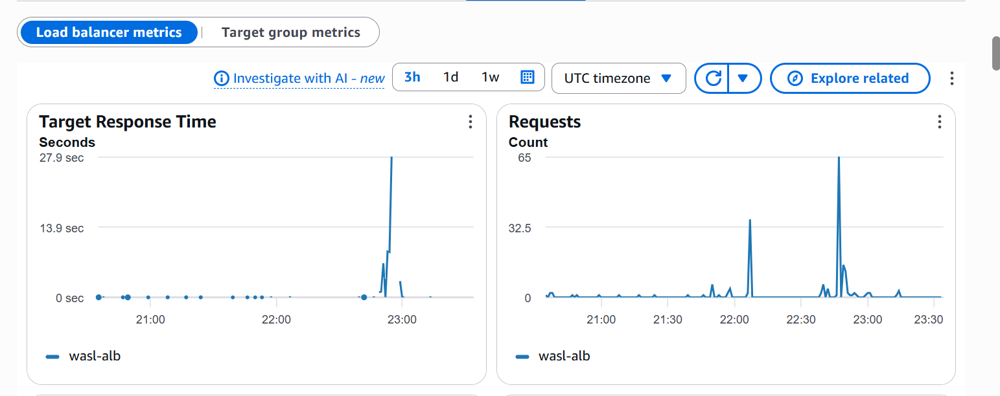

# Wasl — Agentic Logistics Control Tower

> **وصل (Wasl)** — connection / delivery.


Wasl is a logistics control-tower application that combines a grounded internal knowledge assistant with an approval-gated shipment investigation workflow.

An operations user can ask a procedural question, review shipment exceptions, inspect the reasoning trace, and approve or reject a proposed action from one interface. The system retrieves evidence from company policies, applies operational rules, and keeps consequential actions behind a human decision point.

Wasl does not send external messages or execute operational changes automatically.

---

## Demo


The walkthrough follows the main operating path: dashboard review, grounded policy question, shipment investigation, and knowledge-base management.

---

## Interface

<table>
  <tr>
    <td align="center"><strong>Dashboard</strong></td>
    <td align="center"><strong>Ask Wasl</strong></td>
  </tr>
  <tr>
    <td></td>
    <td></td>
  </tr>
  <tr>
    <td align="center"><strong>Investigations</strong></td>
    <td align="center"><strong>Knowledge Base</strong></td>
  </tr>
  <tr>
    <td></td>
    <td></td>
  </tr>
</table>

---

## How the system works

Wasl supports two connected operational flows.

### Ask Wasl

A user asks a logistics policy or procedure question. The backend retrieves the most relevant document chunks from PostgreSQL with pgvector, builds a grounded prompt, and calls Claude only when sufficient supporting context exists.

```text
Question
  -> authentication and request checks
  -> local intent / injection handling
  -> semantic cache lookup
  -> embedding and pgvector retrieval
  -> source-aware reranking
  -> grounded Claude response
  -> filtered citations
```

The answer is returned with the source documents used. When the knowledge base does not contain enough evidence, Wasl returns a controlled decline instead of generating an unsupported policy answer.

### Investigations

A user opens a shipment exception. The LangGraph workflow loads the shipment, evaluates the exception, checks SLA and ETA conditions, retrieves relevant policy, and prepares a recommendation.

```text
Shipment exception
  -> shipment lookup
  -> exception assessment
  -> SLA / ETA evaluation
  -> policy retrieval
  -> recommended action
  -> human approval or rejection
```

The workflow can also determine that no action is required. Expected delays, such as an approved holiday or port closure, can end without unnecessary escalation.

The `draft_message` tool is draft-only. Approval records an operator decision; it does not send an email or customer notification.

---

## Architecture


The production system is organized into four main layers:

| Layer | Responsibility |
|---|---|
| Frontend | React and Vite interface for dashboard, chat, investigations, and knowledge-base management |
| Application | FastAPI routes, authentication, shipment services, RAG service, and LangGraph workflow |
| Data and AI | PostgreSQL, pgvector, Redis, local sentence-transformer embeddings, and Anthropic Claude |
| Infrastructure | CloudFront, S3, Application Load Balancer, ECS Fargate, RDS, CloudWatch, and Terraform |

### Production request path

```text
Browser
  -> CloudFront
  -> S3-hosted React frontend
  -> /api/*
  -> Application Load Balancer
  -> ECS Fargate
  -> FastAPI
  -> PostgreSQL / pgvector, Redis, and Anthropic
```

Alembic manages relational and pgvector schema migrations. Terraform defines the AWS infrastructure.

---

## Grounded retrieval

The knowledge layer accepts PDF, Markdown, and text documents.

```text
Document
  -> extraction
  -> chunking and metadata
  -> all-MiniLM-L6-v2 embeddings
  -> PostgreSQL / pgvector
```

Current retrieval behavior includes:

- persistent pgvector storage in production
- HNSW vector indexing
- compound retrieval for multi-policy questions
- facet-aware reranking
- bounded conversation history for follow-up questions
- semantic answer caching with Redis
- one citation entry per model-used source
- clean decline behavior when evidence is insufficient
- filtering of suspicious instructions found in retrieved content

PDFs are processed page by page so citations can retain page metadata. Scanned PDFs without extractable text are rejected rather than processed with unreliable OCR.

---

## Knowledge base

The repository contains a synthetic logistics policy set covering:

- shipment exception management
- customs-hold escalation
- GCC cross-border holds
- failed delivery handling
- carrier-delay SLA policy
- supplier-delay escalation
- holiday and port-closure continuity
- high-value shipment controls
- customer communication standards
- incident severity classification

Documents can be uploaded and removed through the Knowledge Base interface.

| Property | Value |
|---|---|
| Supported formats | `.pdf`, `.md`, `.txt` |
| Maximum file size | 20 MB |
| Embedding model | `all-MiniLM-L6-v2` |
| Vector dimensions | 384 |
| Production vector store | PostgreSQL + pgvector |

---

## Security and control boundaries

The application includes:

- JWT authentication
- legacy API-key fallback
- request rate limiting
- prompt-injection pattern detection
- deterministic local handling for greetings and direct injection attempts
- retrieved-content filtering
- untrusted-source prompt boundaries
- bounded chat history
- human approval before consequential investigation actions

Application secrets are supplied through environment variables and AWS Secrets Manager rather than committed source files.

---

## AWS operations and monitoring

Wasl runs as an ECS Fargate service behind an Application Load Balancer. CloudWatch collects service metrics and logs, while Container Insights provides task and container-level visibility.

<table>
  <tr>
    <td align="center"><strong>ECS Container Insights</strong></td>
    <td align="center"><strong>Application Load Balancer Monitoring</strong></td>
  </tr>
  <tr>
    <td></td>
    <td></td>
  </tr>
</table>

The monitoring setup covers:

- ECS CPU utilization
- ECS memory utilization
- ALB target response time
- request volume
- application and Redis logs
- task and container visibility through Container Insights

The current workload is lightly utilized, while the latency view makes expensive RAG and LLM requests visible separately from normal API traffic.

---

## Quality and CI

The backend test suite covers routes, authentication, agent tools, RAG behavior, security controls, document ingestion, and pgvector integration.

Latest verified result:

```text
120 tests passed
76% total coverage
98% coverage for app/rag/service.py
```

GitHub Actions runs:

```text
Ruff linting
Alembic migrations
pytest
coverage gate >= 70%
pgvector-enabled PostgreSQL service
```

A separate golden-set evaluation harness is maintained under `wasl-backend/evals/` for RAG and agent regression checks.

```bash
python evals/run_eval.py
python evals/compare.py
```

---

## Technology

| Layer | Implementation |
|---|---|
| Frontend | React, Vite |
| API | FastAPI |
| Authentication | JWT with API-key fallback |
| Agent workflow | LangGraph |
| LLM | Anthropic Claude |
| Embeddings | sentence-transformers, `all-MiniLM-L6-v2` |
| Vector search | PostgreSQL + pgvector |
| Cache | Redis |
| Database | PostgreSQL |
| Migrations | Alembic |
| Containers | Docker |
| Infrastructure | Terraform |
| Cloud | AWS S3, CloudFront, ALB, ECS Fargate, RDS, CloudWatch |
| Testing | pytest |
| Linting | Ruff |
| CI | GitHub Actions |

---

## Project structure

```text
wasl-logistics-agent/
|
|-- .github/
|   `-- workflows/
|       `-- ci.yml
|
|-- wasl-backend/
|   |
|   |-- app/
|   |   |-- agent/            LangGraph workflow and nodes
|   |   |-- api/              authentication, shipment, document, answer and investigation routes
|   |   |-- models/           API and workflow models
|   |   |-- observability/    tracing
|   |   |-- rag/              prompting, retrieval and grounded answer service
|   |   |-- services/         embeddings, LLM, cache, shipments and vector storage
|   |   |-- tools/            investigation tools
|   |   |-- database.py
|   |   |-- db_models.py
|   |   `-- main.py
|   |
|   |-- alembic/              relational and pgvector migrations
|   |-- data/                 synthetic shipments and knowledge documents
|   |-- docs/                 architecture, requirements, threat model, demo and screenshots
|   |-- evals/                golden-set evaluation and regression results
|   |-- infra/                Terraform AWS infrastructure
|   |-- scripts/              ingestion, seeding and deployment utilities
|   |-- tests/                backend test suite
|   |-- Dockerfile
|   |-- docker-compose.yml
|   |-- pyproject.toml
|   `-- requirements.txt
|
|-- wasl-frontend/
|   |-- src/
|   |   |-- App.jsx
|   |   |-- Login.jsx
|   |   |-- api.js
|   |   `-- main.jsx
|   |-- nginx.conf
|   |-- package.json
|   `-- vite.config.js
|
|-- LICENSE
`-- README.md
```

---

## Running locally

### Backend

```bash
cd wasl-backend
python -m venv .venv

# Windows
.venv\Scripts\activate

# macOS / Linux
source .venv/bin/activate

pip install -r requirements.txt
```

Create `.env` from `.env.example`, configure the application and database variables, then run:

```bash
alembic upgrade head
python scripts/ingest.py
uvicorn app.main:app --reload
```

FastAPI documentation:

```text
http://localhost:8000/docs
```

### Frontend

```bash
cd wasl-frontend
npm install
```

Create `.env` from `.env.example`, configure the backend API settings, then run:

```bash
npm run dev
```

Frontend development server:

```text
http://localhost:5173
```

---

## Documentation

| Document | Description |
|---|---|
| [Architecture](wasl-backend/docs/ARCHITECTURE.md) | System components, data flow, RAG pipeline, agent workflow, and deployment design |
| [Product Requirements](wasl-backend/docs/PRD.md) | Product scope, users, requirements, constraints, and success criteria |
| [Threat Model](wasl-backend/docs/THREAT_MODEL.md) | Trust boundaries, prompt-injection risks, security controls, and residual risks |
| [Deployment Guide](wasl-backend/infra/DEPLOY.md) | Terraform and AWS deployment notes |
| [Video Walkthrough](wasl-backend/docs/vid/WASL-walkthrough.mp4) | Short walkthrough of the deployed application and core workflows |

---

## Scope

Wasl is a reference implementation of an AI-assisted logistics operations workflow. It focuses on grounded retrieval, shipment investigation, operational reasoning, approval boundaries, production deployment, and observability rather than reproducing the full scope of a commercial transportation-management platform.

---

## Author

[](https://www.linkedin.com/in/zahoor-ishfaq/)
