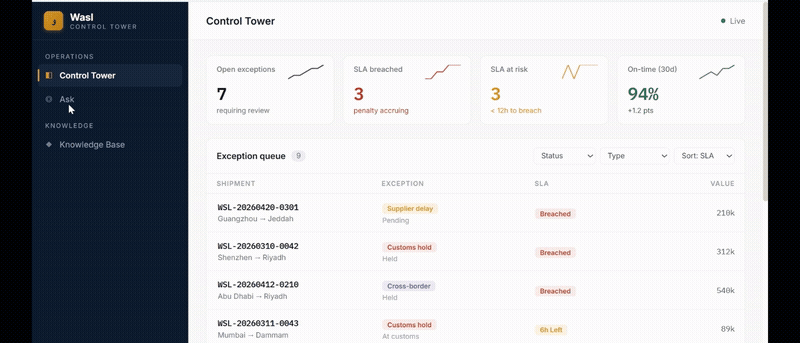
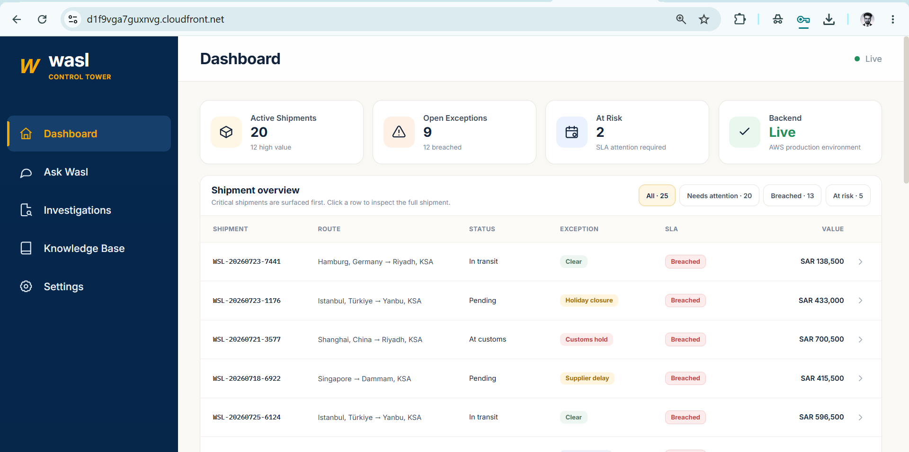
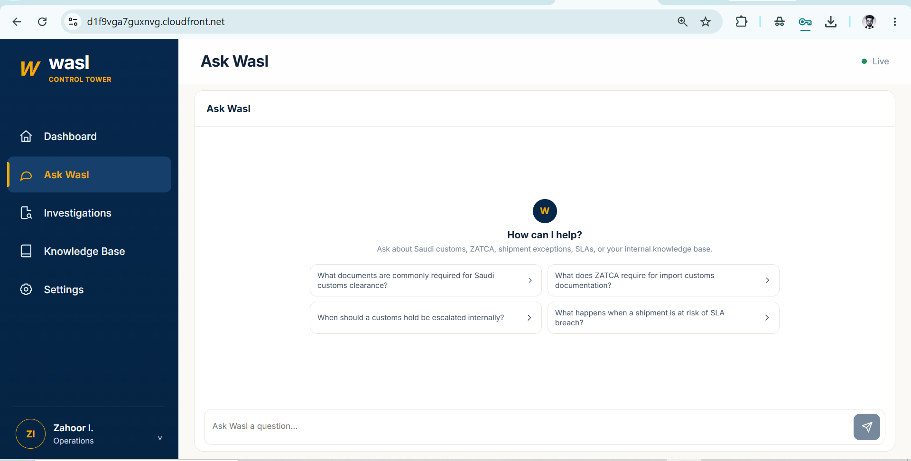
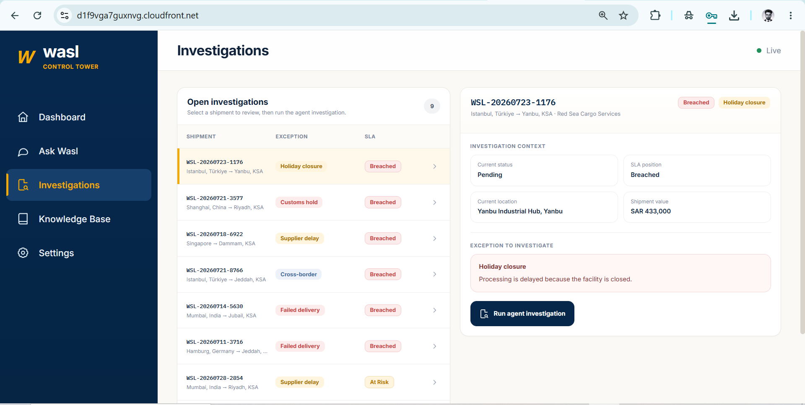
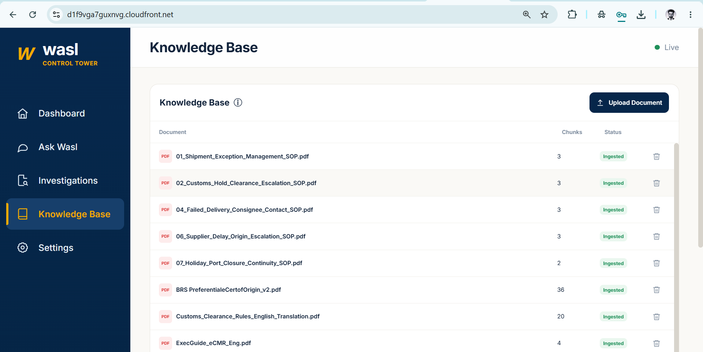
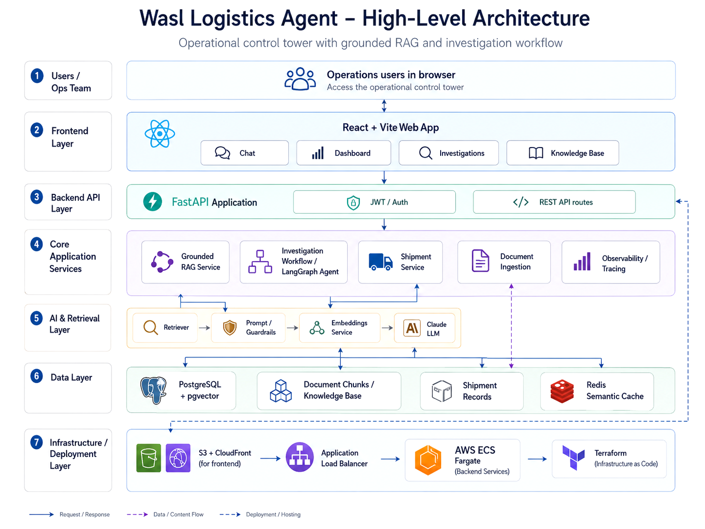

# Wasl — Agentic Logistics Control Tower

> **وصل (Wasl)** — connection / delivery.


Wasl is a logistics control-tower application that combines a grounded knowledge assistant with an approval-gated shipment investigation workflow.

It is designed around two operational flows:

1. **Ask Wasl** answers logistics policy and procedure questions from the internal knowledge base and returns source citations.
2. **Investigations** evaluates shipment exceptions, applies operational rules, retrieves relevant policy, prepares a recommendation, and stops at a human approval boundary.

The system does not send external messages or execute consequential actions automatically.



---

## Interface

<table>
  <tr>
    <td align="center"><strong>Dashboard</strong></td>
    <td align="center"><strong>Ask Wasl</strong></td>
  </tr>
  <tr>
    <td></td>
    <td></td>
  </tr>
  <tr>
    <td align="center"><strong>Investigations</strong></td>
    <td align="center"><strong>Knowledge Base</strong></td>
  </tr>
  <tr>
    <td></td>
    <td></td>
  </tr>
</table>

---

## Architecture



The production system is split into four main parts:

- **React + Vite frontend** for the dashboard, chat, investigations, and knowledge-base management.
- **FastAPI backend** for authentication, shipment APIs, document APIs, grounded answers, and investigation workflows.
- **PostgreSQL + pgvector** for shipment data and persistent document embeddings, with Redis used for semantic caching.
- **AWS infrastructure** with CloudFront and S3 for the frontend, an Application Load Balancer in front of ECS Fargate, and Amazon RDS for PostgreSQL. Infrastructure is managed with Terraform.

### Ask Wasl flow

```text
User
  -> React UI
  -> FastAPI
  -> RAG service
  -> Retriever
  -> PostgreSQL / pgvector
  -> grounded context
  -> Claude
  -> answer + citations
```

If retrieval does not produce sufficient evidence, Wasl returns a controlled decline instead of asking the model to invent an answer.

### Investigation flow

```text
Shipment exception
  -> FastAPI
  -> LangGraph workflow
  -> shipment lookup
  -> exception assessment
  -> policy retrieval
  -> SLA / ETA logic
  -> draft recommendation
  -> human approval boundary
```

The workflow combines deterministic operational rules with LLM reasoning. Policy thresholds and control logic remain rule-based; Claude is used for interpretation, recommendation, and draft generation.

---

## Grounded RAG

The knowledge layer supports operational policies and SOPs stored as PDF, Markdown, or text documents.

The ingestion path is:

```text
Document
  -> text extraction
  -> chunking + metadata
  -> sentence-transformer embeddings
  -> PostgreSQL / pgvector
```

Current retrieval behavior includes:

- local `all-MiniLM-L6-v2` embeddings
- persistent pgvector storage in production
- source-aware citation filtering
- compound / facet-aware retrieval for multi-policy questions
- bounded conversation history for follow-up questions
- semantic answer caching with Redis
- clean decline behavior when supporting context is missing
- filtering of suspicious retrieved instructions before they reach the LLM

PDF uploads are processed page by page. Scanned PDFs without extractable text are rejected rather than silently producing unreliable OCR output.

---

## Investigation workflow

The investigation workflow is implemented as a LangGraph state machine.

Operational tools include:

| Tool | Responsibility |
|---|---|
| `shipment_lookup` | Load shipment and exception data |
| `compute_eta` | Calculate ETA / SLA position |
| `policy_search` | Retrieve relevant operational policy |
| `draft_message` | Prepare a proposed communication or action |

The graph can determine that no action is required. Expected delays such as an approved closure can therefore terminate without creating an unnecessary escalation.

`draft_message` is intentionally draft-only. Approval records the operator decision, but Wasl does not send an email or customer message itself.

---

## Knowledge base

The repository includes a synthetic logistics knowledge base covering:

- shipment exception management
- customs-hold escalation
- GCC cross-border holds
- failed delivery handling
- carrier-delay SLA policy
- supplier-delay escalation
- holiday and port-closure continuity
- high-value shipment controls
- customer communication standards
- control-tower incident severity

Documents can also be uploaded and removed through the Knowledge Base UI.

Supported upload types:

```text
.pdf
.md
.txt
```

Maximum upload size: **20 MB**.

---

## Security and control boundaries

The backend includes:

- JWT authentication
- legacy API-key compatibility
- request rate limiting
- prompt-injection pattern checks
- local handling for greetings, capability questions, and direct injection attempts
- retrieved-content filtering
- source instructions treated as untrusted data
- human approval before consequential investigation actions

Secrets are supplied through environment variables and deployment configuration rather than committed application files.

---

## Production deployment

```text
Browser
   |
CloudFront
   |
S3 frontend
   |
/api/*
   |
Application Load Balancer
   |
ECS Fargate
   |
FastAPI
   |
+-------------------+------------------+
|                   |                  |
RDS PostgreSQL      Redis              Anthropic
+ pgvector          cache              Claude
```

Terraform provisions the AWS application infrastructure. Alembic manages relational and pgvector schema migrations.

---

## Quality and CI

The repository contains unit, route, RAG, agent, security, and pgvector integration tests.

Latest verified test run:

```text
120 passed
76% total coverage
98% coverage for app/rag/service.py
```

CI checks include:

```text
Ruff linting
Alembic migrations
pytest
coverage gate >= 70%
pgvector-enabled PostgreSQL service
```

A separate golden-set evaluation harness is kept under `wasl-backend/evals/` for RAG and agent regression checks.

```bash
python evals/run_eval.py
python evals/compare.py
```

---

## Technology

| Layer | Implementation |
|---|---|
| Frontend | React, Vite |
| API | FastAPI |
| Authentication | JWT + API-key fallback |
| Agent workflow | LangGraph |
| LLM | Anthropic Claude |
| Embeddings | sentence-transformers / `all-MiniLM-L6-v2` |
| Vector search | PostgreSQL + pgvector |
| Cache | Redis |
| Database | PostgreSQL |
| Migrations | Alembic |
| Containers | Docker |
| Infrastructure | Terraform |
| Cloud | AWS S3, CloudFront, ALB, ECS Fargate, RDS |
| Testing | pytest |
| Linting | Ruff |
| CI | GitHub Actions |

---

## Project structure

```text
wasl-logistics-agent/
|
|-- .github/
|   `-- workflows/
|       `-- ci.yml
|
|-- wasl-backend/
|   |
|   |-- app/
|   |   |-- agent/            LangGraph workflow and nodes
|   |   |-- api/              auth, shipment, document, answer and investigation routes
|   |   |-- models/           API and workflow models
|   |   |-- observability/    tracing
|   |   |-- rag/              prompt, retrieval and grounded answer service
|   |   |-- services/         embeddings, LLM, cache, shipments and vector storage
|   |   |-- tools/            investigation tools
|   |   |-- database.py
|   |   |-- db_models.py
|   |   `-- main.py
|   |
|   |-- alembic/              database and pgvector migrations
|   |-- data/                 synthetic shipments and knowledge documents
|   |-- docs/                 architecture, PRD, threat model, demo and screenshots
|   |-- evals/                golden-set evaluation and regression results
|   |-- infra/                Terraform AWS infrastructure
|   |-- scripts/              ingestion, seeding and deployment utilities
|   |-- tests/                backend test suite
|   |-- Dockerfile
|   |-- docker-compose.yml
|   |-- pyproject.toml
|   `-- requirements.txt
|
|-- wasl-frontend/
|   |-- src/
|   |   |-- App.jsx
|   |   |-- Login.jsx
|   |   |-- api.js
|   |   `-- main.jsx
|   |-- nginx.conf
|   |-- package.json
|   `-- vite.config.js
|
|-- LICENSE
`-- README.md
```

---

## Running locally

### Backend

```bash
cd wasl-backend

python -m venv .venv

# Windows
.venv\Scripts\activate

# macOS / Linux
source .venv/bin/activate

pip install -r requirements.txt
```

Create `.env` from `.env.example`, configure the required application and database variables, then run:

```bash
alembic upgrade head
python scripts/ingest.py
uvicorn app.main:app --reload
```

FastAPI documentation is available at:

```text
http://localhost:8000/docs
```

### Frontend

```bash
cd wasl-frontend
npm install
```

Create `.env` from `.env.example`, configure the backend API settings, then run:

```bash
npm run dev
```

The Vite development server runs on:

```text
http://localhost:5173
```

---

## Documentation

Additional project documentation is maintained in:

- `wasl-backend/docs/ARCHITECTURE.md` — architecture notes and technical design
- `wasl-backend/docs/PRD.md` — product requirements
- `wasl-backend/docs/THREAT_MODEL.md` — security assumptions, threats, and mitigations
- `wasl-backend/infra/DEPLOY.md` — AWS deployment notes

---

## Scope

Wasl is a reference implementation of an AI-assisted logistics operations workflow. The project focuses on retrieval, investigation, operational reasoning, approval boundaries, and production deployment rather than attempting to reproduce the full feature set of a commercial transportation-management or control-tower platform.
